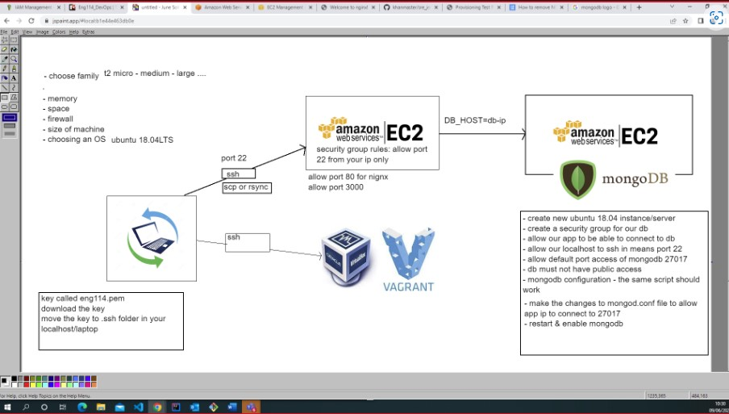
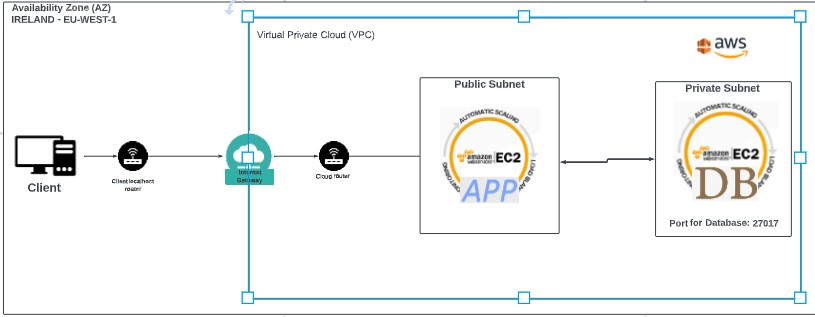

# AWS EC2

## Planning
---
- choose family - t2 micro / medium / large ..
- hard drive
- memory
- space
- fire wall
- size of machine
- choosing an OS - ubuntu 18.04LTS

## Process 
1. Search ec2,
2. Create instance
3. select machine - ubuntu 18.04 LTS server
4. Select tags eng114_...
5. Select security rules 
    - ec2 allows port 22 by default
    - nginx port 80
    - app port 3000

## Copy files from localhost to EC2
`scp -i [key_file] -r [path to folder/file you want copied] [path to location you want file to go to]:~`

## AWS Network Diagram
---

## Two tier network
---

## What are Amazon machine images (AMI)
----
Takes a snap shot of the machine and it's data at that time